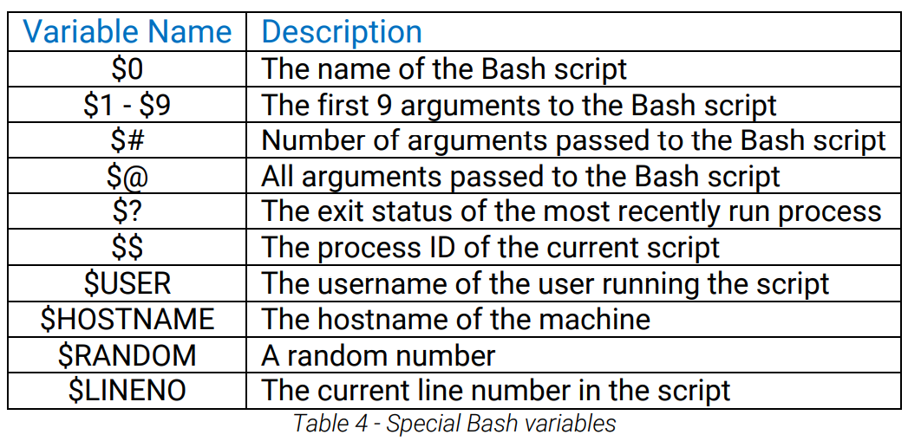
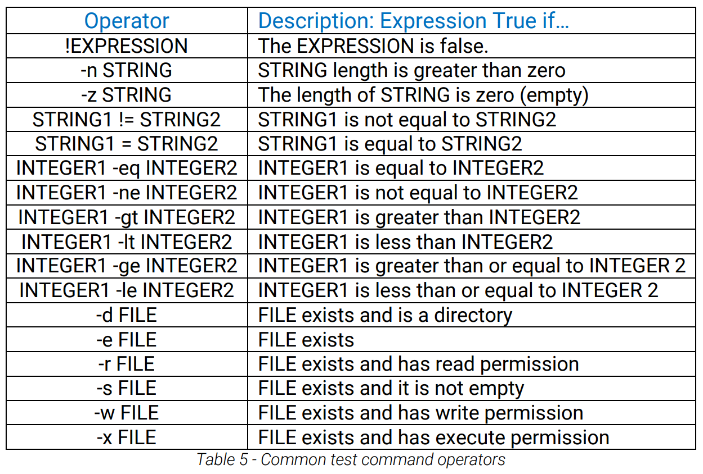

# Bash Scripting

- have shebang at top

```bash
#!/bin/bash
```

- need executable permissions to run

```
chmod +x file.sh
```

- variables
- use `$` infront of var name of access vars

```bash
greeting='Hello World'
echo $greeting # print 'Hello World' to console
```

- get username

```bash
user=$(whoami)
echo $user
```

- get command line arguments when executing the script

```bash
echo "The first two arguments are $1 and $2"

# > ./arg.sh hello there
# The first two arguments are hello and there
```



- prompts / user input

```
kali@kali:~$ cat ./input.sh
#!/bin/bash
echo "Hello there, would you like to learn how to hack: Y/N?"
read answer
echo "Your answer was $answer"

kali@kali:~$ chmod +x ./input.

kali@kali:~$ ./input.sh
Hello there, would you like to learn how to hack: Y/N?
Y
Your answer was Y
```

- prompts

```bash
read -p 'Username: ' username
# get input to same line
# store it to variable `username`

read -sp 'Password: ' password
# get input to same line
# dont show whats being entered to user
# store it to variable `password`
```

- if statements
- `-lt` means less than
- 

```bash
#!/bin/bash
read -p "What is your age: " age
if [ $age -lt 16 ]
then
 echo "You might need parental permission to take this course!"
elif [ $age -gt 60 ]
then
 echo "Hats off to you, respect!"
else
 echo "Welcome to the course!"
fi

# What is your age: 65
# Hats off to you, respect!
```

- boolean logic
- `&&` and
- `||` or
- `==` is equal?

```bash
if [ $USER == 'kali' ] && [ $HOSTNAME == 'kali' ]
then
 echo "Multiple statements are true!"
else
 echo "Not much to see here..."
fi
```

- sequence
- ping/echo many IPs at once

```bash
# method 1
for ip in $(seq 1 10); do echo 10.11.1.$ip; done

# method 2
for i in {1..10}; do echo 10.11.1.$i;done

# results
# ----------
# 10.11.1.1
# 10.11.1.2
# 10.11.1.3
# 10.11.1.4
# 10.11.1.5
# 10.11.1.6
# 10.11.1.7
# 10.11.1.8
# 10.11.1.9
# 10.11.1.10
```

- a basic while loop

```bash
counter=1

while [ $counter -lt 10 ] do
  echo "10.11.1.$counter"
  ((counter++))
done
```

- functions with args
- without a `return` statement

```bash
pass_arg() {
  echo "Today's random number is: $1"
}

# calling the function
pass_arg $RANDOM
```

- `$RANDOM` will create a random number, like: `25207`

- use value returned by the last function
- use `$?` here

```bash
return_me() {
  echo "Oh hello there, I'm returning a random value!"
  return $RANDOM
}

return_me
echo "The previous function returned a value of $?"
```

- get a list of IPs for a bunch of domain names

```bash
for url in $(cat list.txt); do host $url; done
# admin.megacorpone.com has address 38.100.193.83
# beta.megacorpone.com has address 38.100.193.88

# so, we get only the address
# ---
for url in $(cat list.txt); do host $url; done | grep "has address" | cut
-d " " -f 4 | sort -u
# 173.246.47.170
# 38.100.193.66
```

- search for exploits in exploit-db
- will search for exploits with "afd windows" in title
- `-w` will return the exploit-db url
- `-t` will return the title

```bash
searchsploit afd windows -w -t
```

- download raw code for all the exploits returned from the searchsploit command (exploit-db urls)
- here, the query is "afd windows"
- the file names will be saved as the exploit id for that exploit given by exploit-db

```bash
for e in $(searchsploit afd windows -w -t | grep http | cut -f 2 -d "|"); do exp_name=$(echo $e | cut -d "/" -f 5) && url=$(echo $e | sed 's/exploits/raw/') && wget -q --no-check-certificate $url -O $exp_name; done
```

- scan the entire class C subnet to look for web servers
- and save the output to `./nmap-scan_10.11.1.1-254`

```bash
sudo nmap -A 5 -p80 - --open 10.11.1.0/24 -oG nmap-scan_10.11.1.1-254\

# then, from that report, print the IPs that are up
cat nmap-scan_10.11.1.1-254 | grep 80 | grep -v "Nmap" | awk '{print R$2}'

# use `cutycapt` to capture screenshots from the web servers
for ip in $(cat nmap-scan_10.11.1.1-254 | grep 80 | grep -v "Nmap" | awk '{print $2}'); do cutycapt --url=$ip --out=$ip.png;done
```

- use `cutycapt` to capture screenshots from the web servers, when visited to that IP / domain / url

```bash
cutycapt --url=http://192.168.1.2:80 --out=filename.png
```

- script to make a single html file from all images in the current working directory: `pngtohtml.sh`
- will work for all `*.png` files

```bash
#!/bin/bash
# Bash script to examine the scan results through HTML.

echo "<HTML><BODY><BR>" > web.html
ls -1 *.png | awk -F : '{ print $1":\n<BR><BR>"}' >> web.html
echo "</BODY></HTML>" >> web.html
```
